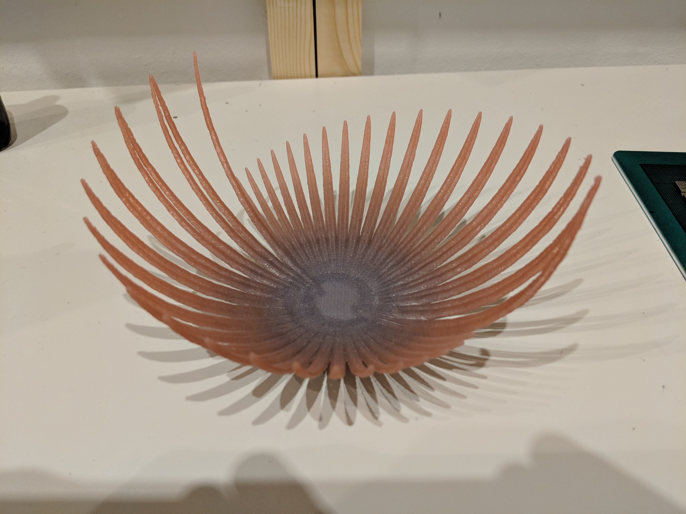

# Pendulum Bowl Generator

### Simulates a spherical pendulum and exports the traced path as an OpenSCAD file for 3D printing!

I thought this would be cool so I made it!

The code simulates a pendulum moving in three dimensions based on some initial conditions, and then stores the traced path. This path is then used to generate a "bowl" shape based on the motion of the pendulum as an OpenSCAD script.

### Usage
Edit pendulum.py with your initial conditions for the simulation and then run it! Play around with them until you find a result you like.
When you find a path shape you like, open "output.scad" in OpenSCAD, and hit preview. If you still like it, hit render and wait forever and ever, until the model is finished. Then export an STL and print it as you normally would!

If you care, here's a [short Twitter thread](https://twitter.com/walkerdanny/status/964792100800823298) on its development.
